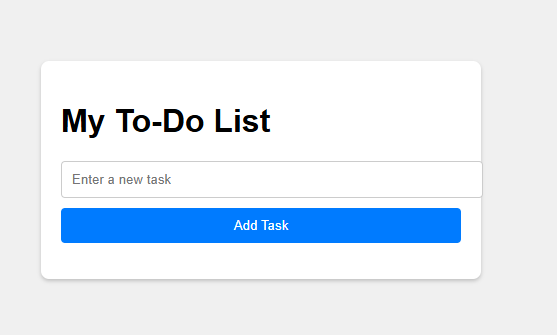

# 📝 To-Do List Application

 *(Replace with your actual screenshot)*

## 🌟 Overview

A dynamic To-Do List web application that allows users to add, view, and remove tasks. Built with vanilla JavaScript, this project demonstrates core DOM manipulation techniques and event handling.

## ✨ Features

- **Add tasks** by clicking the button or pressing Enter
- **Remove tasks** with individual delete buttons
- **Input validation** prevents empty tasks
- **Responsive design** works on all devices
- **Clean UI** with intuitive interactions

## 🛠️ Technologies

- **Frontend**: HTML5, CSS3, JavaScript (ES6)
- **Version Control**: Git
- **Compatibility**: All modern browsers

## 🚀 Getting Started

1. Clone the repository:

   ```bash
   git clone https://github.com/babasalieu360/dynamic-to-do-list-js.git
